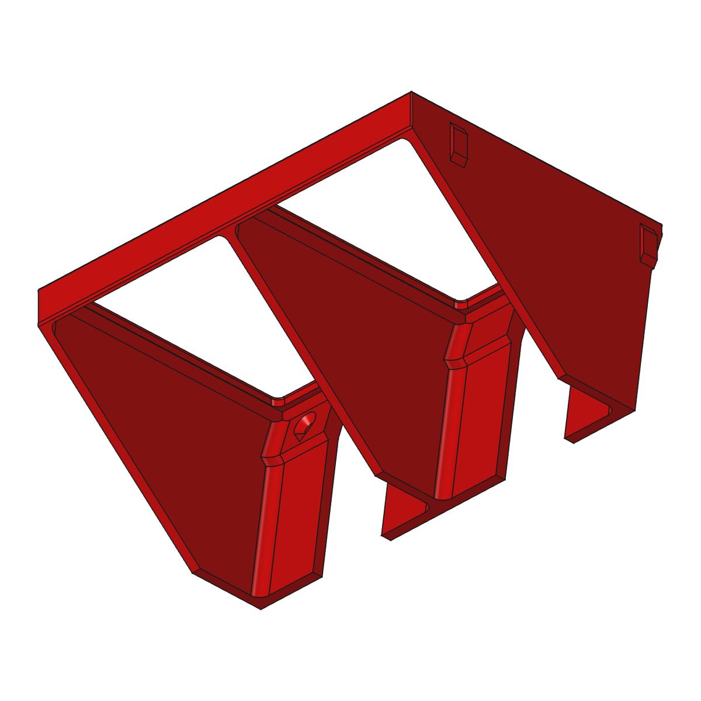
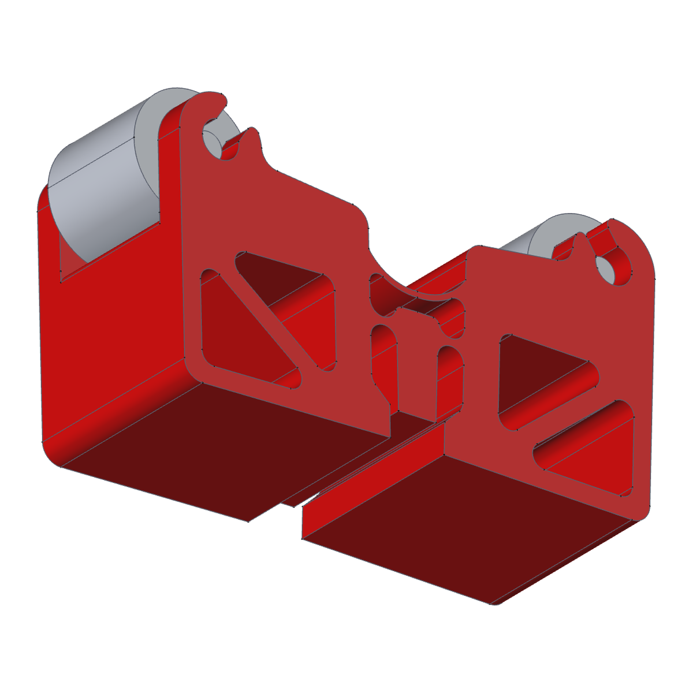
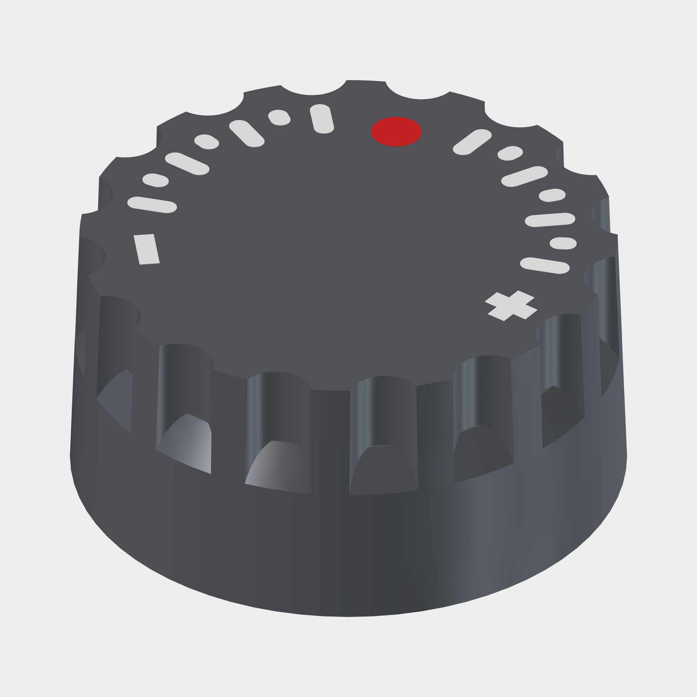

# JOBO Repair Parts

3D-printable replacement and add-on parts for **JOBO** film processors (CPE2 / CPE2+, the JOBO lift). Each part is a parametric FreeCAD model with printing notes and, where the part carries load, a strength check. STEP files are provided for the established rigid parts.

## Downloads

Each link downloads the file directly. STEP files open in any CAD program or slicer. The FCStd files are the parametric FreeCAD models.

| Part | Print files (STEP) | FreeCAD model | Extras |
|---|---|---|---|
| **Bottle hanger** | [Standard module, 2 bottles](https://github.com/sasha-nordiclab/jobo-repair-parts/raw/main/cpe2-bottle-hanger/step/JOBO_CPE2_Hanger_2_Sections.step) · [Spacer module](https://github.com/sasha-nordiclab/jobo-repair-parts/raw/main/cpe2-bottle-hanger/step/JOBO_CPE2_Hanger_2_Sections_Spacer20.step) · [3 sections](https://github.com/sasha-nordiclab/jobo-repair-parts/raw/main/cpe2-bottle-hanger/step/JOBO_CPE2_Hanger_3_Sections.step) · [4 sections](https://github.com/sasha-nordiclab/jobo-repair-parts/raw/main/cpe2-bottle-hanger/step/JOBO_CPE2_Hanger_4_Sections.step) · [Backplate M4](https://github.com/sasha-nordiclab/jobo-repair-parts/raw/main/cpe2-bottle-hanger/step/JOBO_CPE2_Backplate_M4_2_Sections.step) · [TPU gasket](https://github.com/sasha-nordiclab/jobo-repair-parts/raw/main/cpe2-bottle-hanger/step/JOBO_CPE2_Gasket_TPU_2_Sections.step) | [FCStd](https://github.com/sasha-nordiclab/jobo-repair-parts/raw/main/cpe2-bottle-hanger/cad/JOBO_CPE2_Bottle_Hanger.FCStd) | — |
| **Drum supports** | [Stand 1500](https://github.com/sasha-nordiclab/jobo-repair-parts/raw/main/drum-support/step/Stand_1500.step) · [Stand 2840](https://github.com/sasha-nordiclab/jobo-repair-parts/raw/main/drum-support/step/Stand_2840.step) · [Lift 1500 A](https://github.com/sasha-nordiclab/jobo-repair-parts/raw/main/drum-support/step/Lift_1500_A.step) · [Lift 1500 B](https://github.com/sasha-nordiclab/jobo-repair-parts/raw/main/drum-support/step/Lift_1500_B.step) · [Lift 2500 A](https://github.com/sasha-nordiclab/jobo-repair-parts/raw/main/drum-support/step/Lift_2500_A.step) · [Lift 2500 B](https://github.com/sasha-nordiclab/jobo-repair-parts/raw/main/drum-support/step/Lift_2500_B.step) · [Lift Expert A](https://github.com/sasha-nordiclab/jobo-repair-parts/raw/main/drum-support/step/Lift_Expert_A.step) · [Lift Expert B](https://github.com/sasha-nordiclab/jobo-repair-parts/raw/main/drum-support/step/Lift_Expert_B.step) | [FCStd](https://github.com/sasha-nordiclab/jobo-repair-parts/raw/main/drum-support/cad/Jobo_Drum_Support.FCStd) | [JOBO roller (reference, not printed)](https://github.com/sasha-nordiclab/jobo-repair-parts/raw/main/drum-support/step/Roller_Jobo_reference.step) |
| **Control knob** | [Blank](https://github.com/sasha-nordiclab/jobo-repair-parts/raw/main/knob/step/jobo-knob-blank.step) · [Assembly](https://github.com/sasha-nordiclab/jobo-repair-parts/raw/main/knob/step/jobo-knob-assembly.step) · [Insert: dot + digits](https://github.com/sasha-nordiclab/jobo-repair-parts/raw/main/knob/step/jobo-knob-dot-digits.step) · [Insert: dot + indicator](https://github.com/sasha-nordiclab/jobo-repair-parts/raw/main/knob/step/jobo-knob-dot-indicator.step) · [Insert: dot + scale](https://github.com/sasha-nordiclab/jobo-repair-parts/raw/main/knob/step/jobo-knob-dot-scale.step) | [FCStd](https://github.com/sasha-nordiclab/jobo-repair-parts/raw/main/knob/cad/JoboKnob.FCStd) | [Laser digits (SVG)](https://github.com/sasha-nordiclab/jobo-repair-parts/raw/main/knob/laser/jobo-knob-laser-dot-digits.svg) · [Laser digits (DXF)](https://github.com/sasha-nordiclab/jobo-repair-parts/raw/main/knob/laser/jobo-knob-laser-dot-digits.dxf) · [Laser indicator (SVG)](https://github.com/sasha-nordiclab/jobo-repair-parts/raw/main/knob/laser/jobo-knob-laser-dot-indicator.svg) · [Laser indicator (DXF)](https://github.com/sasha-nordiclab/jobo-repair-parts/raw/main/knob/laser/jobo-knob-laser-dot-indicator.dxf) · [Laser scale (SVG)](https://github.com/sasha-nordiclab/jobo-repair-parts/raw/main/knob/laser/jobo-knob-laser-dot-scale.svg) · [Laser scale (DXF)](https://github.com/sasha-nordiclab/jobo-repair-parts/raw/main/knob/laser/jobo-knob-laser-dot-scale.dxf) |

| **TPU tube clips** | — | [FCStd](tube-clips-tpu/cad/JOBO_TPU_Tube_Clips.FCStd) | [Dimensions and print notes](tube-clips-tpu/README.md) |

The whole repository as a zip: [main.zip](https://github.com/sasha-nordiclab/jobo-repair-parts/archive/refs/heads/main.zip). Screws, nuts and print settings for each part are in its README.

## Parts

| Part | What it does | Folder |
|---|---|---|
| **Bottle hanger** | Holds 2–4 JOBO bottles in the CPE2 water bath; screws to the tank wall with M4 screws into a printed nut backplate. | [`cpe2-bottle-hanger/`](cpe2-bottle-hanger/) |
| **Drum supports** | Roller supports for the far end of the drum: stands that clip onto the bath rib, and supports for the lift rods (1500, 2500 and Expert drums). | [`drum-support/`](drum-support/) |
| **Control knob** | Replacement knob for the CPE2 / CPE2+, Ø 33 mm, with multicolour marking inserts and laser-engraving files. | [`knob/`](knob/) |
| **TPU tube clips** | Glue-on snap clips for silicone tubes with 9 mm and 12 mm outside diameters. | [`tube-clips-tpu/`](tube-clips-tpu/) |

## Shared pump model and accessories

The [ROTEK A01VP repository](https://github.com/sasha-nordiclab/ROTEK-A01VP) holds the parametric reference model of the Rotek circulation pump and compatible accessories, starting with a TPU vibration-damping holder. The same pump is used in the THD CP-Lift project. The [FreeCAD model](https://github.com/sasha-nordiclab/ROTEK-A01VP/blob/main/cad/TPU_Pump_Holder.FCStd) contains both the pump and the holder.

<table align="center">
  <tr><td align="center"> <b>Bottle hanger</b></td>
      <td align="center"> <b>Drum supports</b></td>
      <td align="center"> <b>Control knob</b></td></tr>
</table>

## Common notes

- **Material:** PETG, ABS or ASA for rigid parts near the water bath; the tube clips are designed for TPU. PLA softens and creeps at 38–40 °C.
- **Models:** FreeCAD 1.x (made with a 26.3 development build; the knob with 1.1). The STEP files open in any CAD or slicer.
- **Parameters:** every model is driven by spreadsheets. Change the values there and recompute.
- **Strength checks:** `tools/fem/femkit.py` (Gmsh + CalculiX, layered-PETG criterion) and one script per part in its `fem/` folder.
- **Readable diffs:** `.FCStd` files are zip archives. After cloning, run this once so `git diff` shows the parameters:

      git config diff.fcstd.textconv "python3 tools/fcstd-textconv.py"

## License

[CC BY-NC-SA 4.0](LICENSE). You may share and adapt these designs with attribution, not for commercial use, and under the same license.
