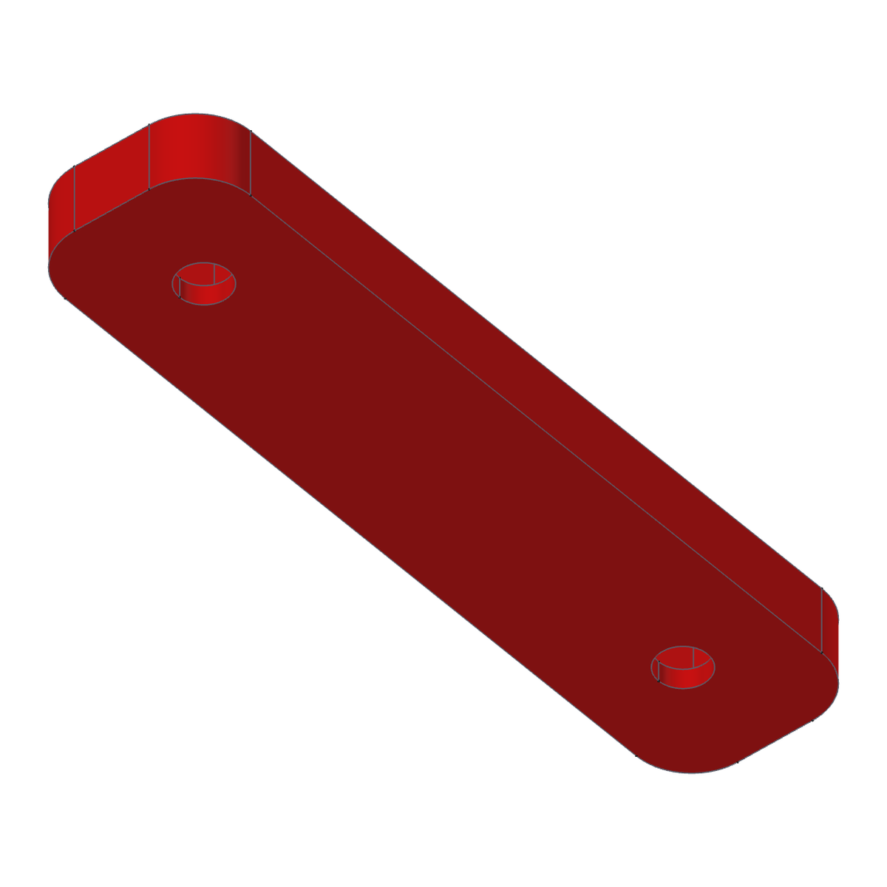

# JOBO CPE2 bottle hanger

A printed hanger for JOBO bottles in the water bath of a **JOBO CPE2 / CPE2+** processor. One part holds 2, 3 or 4 bottles in a row. It mounts on the tilted tank wall with countersunk M4 screws, and a small printed backplate with nut pockets sits on the other side of the wall.

 

## How it works

- Each bottle drops through a 93 × 70 mm window in the frame. A small bump on the bottle side catches under the **front lip**, so an empty bottle cannot float up.
- The **mount wall** follows the CPE2 tank wall, which kinks 17 mm below the rim: 17° lean above the kink, 7.5° below (relative to the frame).
- Two **M4 countersunk screws per section** go through the wall into M4 nuts held in a printed **backplate** on the outside of the tank.
- **Gussets** between the sections carry the load from the frame into the wall. Neighbouring sections share one gusset.

## Files

| Path | What |
|---|---|
| `cad/JOBO_CPE2_Bottle_Hanger.FCStd` | Parametric FreeCAD model |
| `step/JOBO_CPE2_Hanger_{2,3,4}_Sections.step` | Hanger for 2, 3 or 4 bottles |
| `step/JOBO_CPE2_Hanger_2_Sections_Spacer30_Left.step` | 2-bottle hanger with a 30 mm top-plate extension on the left: the third module of the standard set |
| `step/JOBO_CPE2_Backplate_M4.step` | Backplate with two M4 nut pockets; print one per section |
| `fem/hanger_fem.py`, `docs/fem_results.json` | Strength check and its results |

## Model

- `Parameters` (spreadsheet): every size, with a comment per row. Derived rows are marked *do not edit*.
- `Cell` (PartDesign body): **one section** with all its features.
- `Hanger` (Draft array): `SECTIONS` cells at `PITCH` = 80 mm, fused into one solid. Each cell is `PITCH + G_T` long, so the end gussets of neighbours coincide and become one shared gusset.
- `Hanger_Final` (PartDesign body on top of the array): adds the optional spacer plate `EXT_LEFT` (0 = none). **This is the part you print.**
- `Backplate` (PartDesign body): 72 × 16.8 × 6 mm, two Ø 4.4 holes and two 7.3 mm hex pockets, 4.2 mm deep.

Change `SECTIONS` (2, 3, 4…) or `EXT_LEFT` and recompute. Other useful values: `WIN_Y` (window width), `TANK_TILT`, `TANK_TILT2`, `KINK_Z` (tank wall shape), `BOLT_Y`, `NUT_AF`, `NUT_DEPTH`.

## Standard set

The tank is filled with **2-bottle modules** (each fits the bed easily):

| Position | Part | STEP |
|---|---|---|
| 1 | 2-bottle module | `JOBO_CPE2_Hanger_2_Sections.step` |
| 2 | 2-bottle module | `JOBO_CPE2_Hanger_2_Sections.step` |
| 3 | 2-bottle module with a **30 mm spacer plate** on the left | `JOBO_CPE2_Hanger_2_Sections_Spacer30_Left.step` |

The spacer is only the top plate (3 mm, `FRAME_T`), no wall or gussets under it. It bridges the 30 mm gap between module 2 and module 3. *Left* = seen from the bottle side, looking at the tank wall (model −Y). For a spacer on the right, mirror the part in the slicer; the hanger is symmetric.

## Printing

| Part | Qty | Orientation | Time / mass (PETG, A1) |
|---|---|---|---|
| Hanger, 2 sections | 1 | frame face down, no supports | ≈ 3 h 34 min, 151 g |
| Hanger, 2 sections + 30 mm spacer | 1 | frame face down, no supports | ≈ 3 h 50 min, 165 g |
| Hanger, 3 sections | 1 | frame face down, no supports | ≈ 4 h 59 min, 213 g |
| Hanger, 4 sections | 1 | 323.6 mm long: does not fit a 256 mm bed | — |
| Backplate | 1 per section | flat face down, pockets up | ≈ 21 min, 8.5 g |

Profile: 0.4 mm nozzle, 0.6 mm lines, 0.2 mm layers, 5 walls, 100 % rectilinear infill. PETG or ABS; not PLA, because the bath is warm.

## Mounting

Per section: 2 × M4 countersunk screws (ISO 10642 or ISO 14581, head Ø ≤ 9 mm), 2 × M4 nuts (7 mm AF). The default stack (6 mm wall + 1 mm tank + 6 mm backplate − 4.2 mm pocket + nut) needs **M4 × 12**. The cell `D_SCREW` in `Parameters` gives the length for other sizes.

## Strength (FEM, 3 sections)

CalculiX, second-order tetrahedra, layered PETG (40 / 20 / 15 MPa in-plane / layer peel / layer shear, × 0.85 for the warm bath). The screw seats are bonded; the tank wall pushes on the part but cannot pull, so each case is supported only on the wall segment that is pressed into the tank.

| Case | Load | Load / allowable (≤ 1 passes) |
|---|---|---|
| Empty bottles floating (sustained, safety factor 4) | 5.9 N up on the lip of every section | **0.36** ✅ |
| Full 0.7 kg bottle knocked onto the front edge at 0.5 m/s (safety factor 2) | 187 N (stiffness 199 N/mm) | 1.08 |

The knock uses part of the safety factor of 2 but stays below the material strength. Forces balance in both cases (residual 0.0 N).

 

## History

Release `v1.1.0` built 2-, 3- and 4-section hangers by joining copies of one section with seam patches. This version rebuilds them as one parametric cell plus an array, uses the M4 nut backplate per section, and keeps the geometry of the printed and tested section (hook, tilted wall with the kink, gussets, countersinks).
