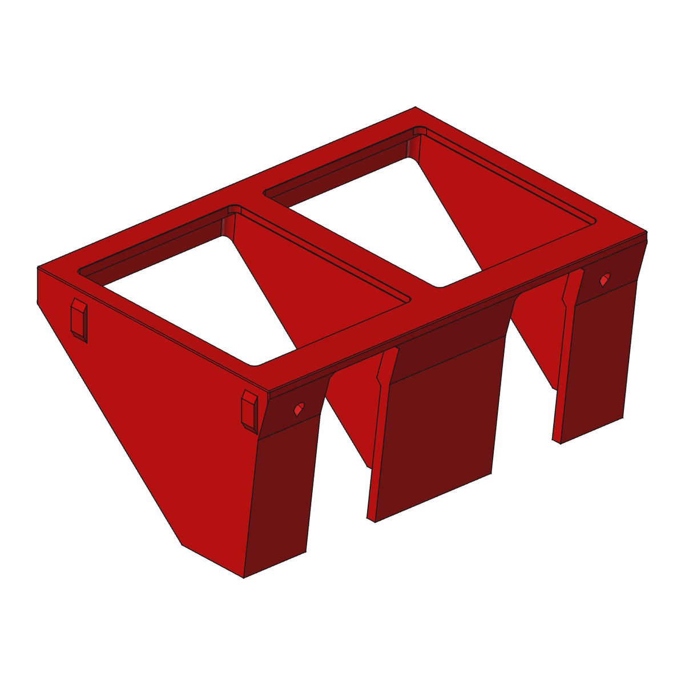
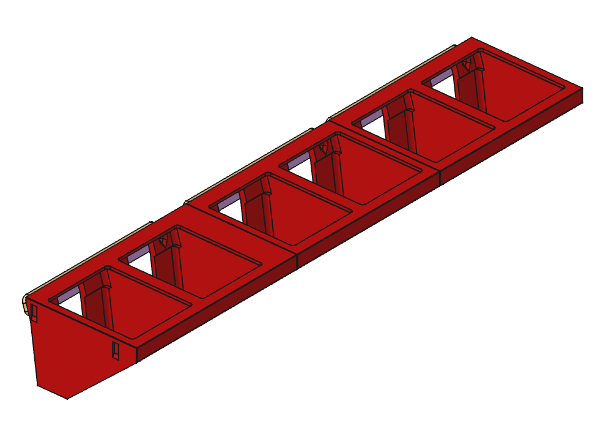
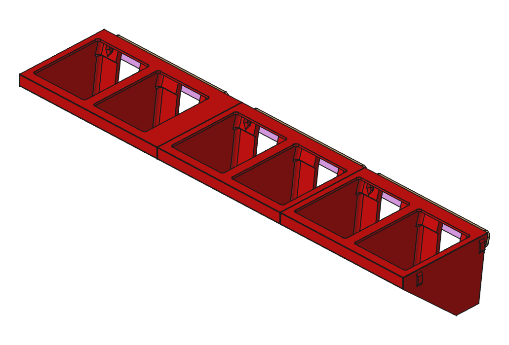
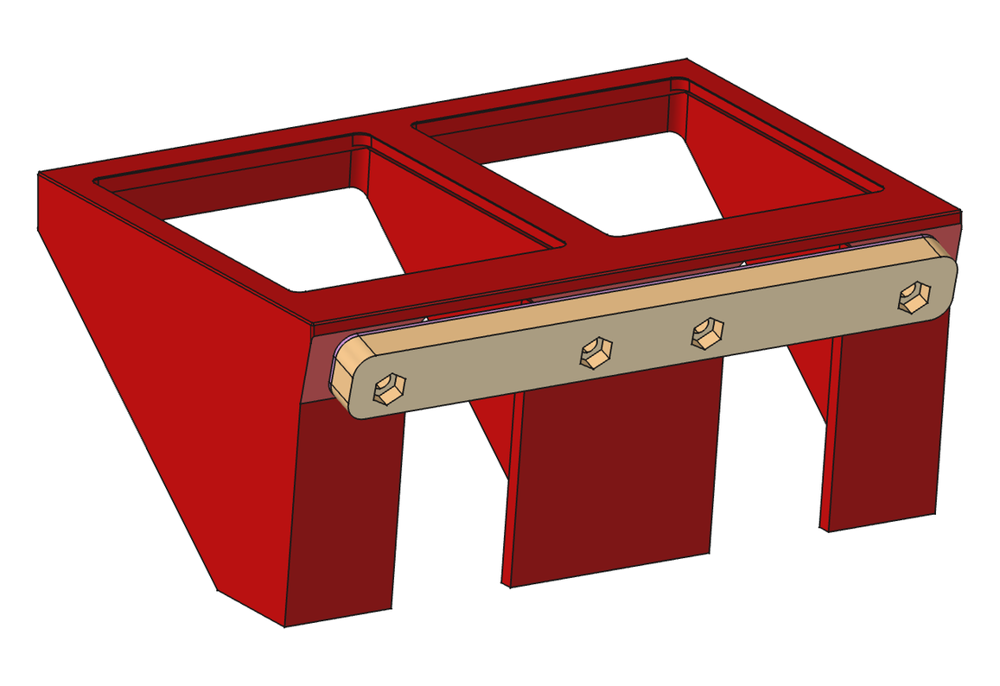
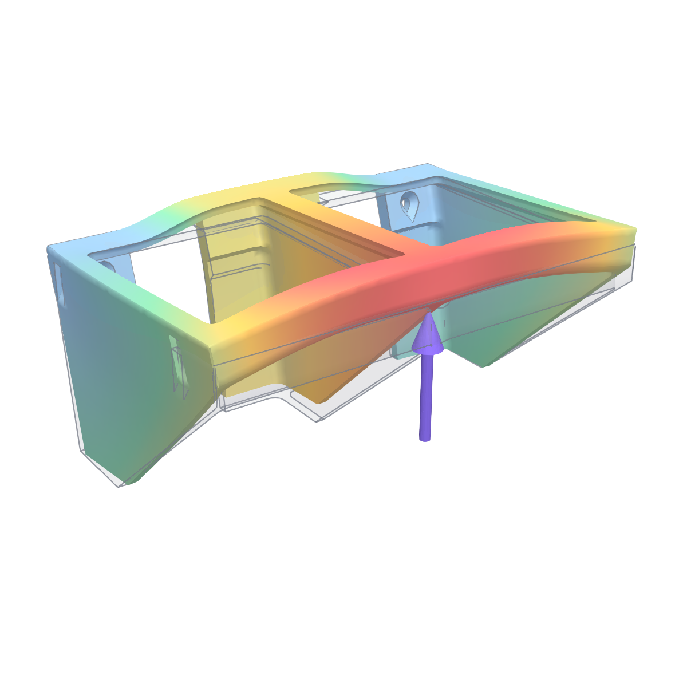
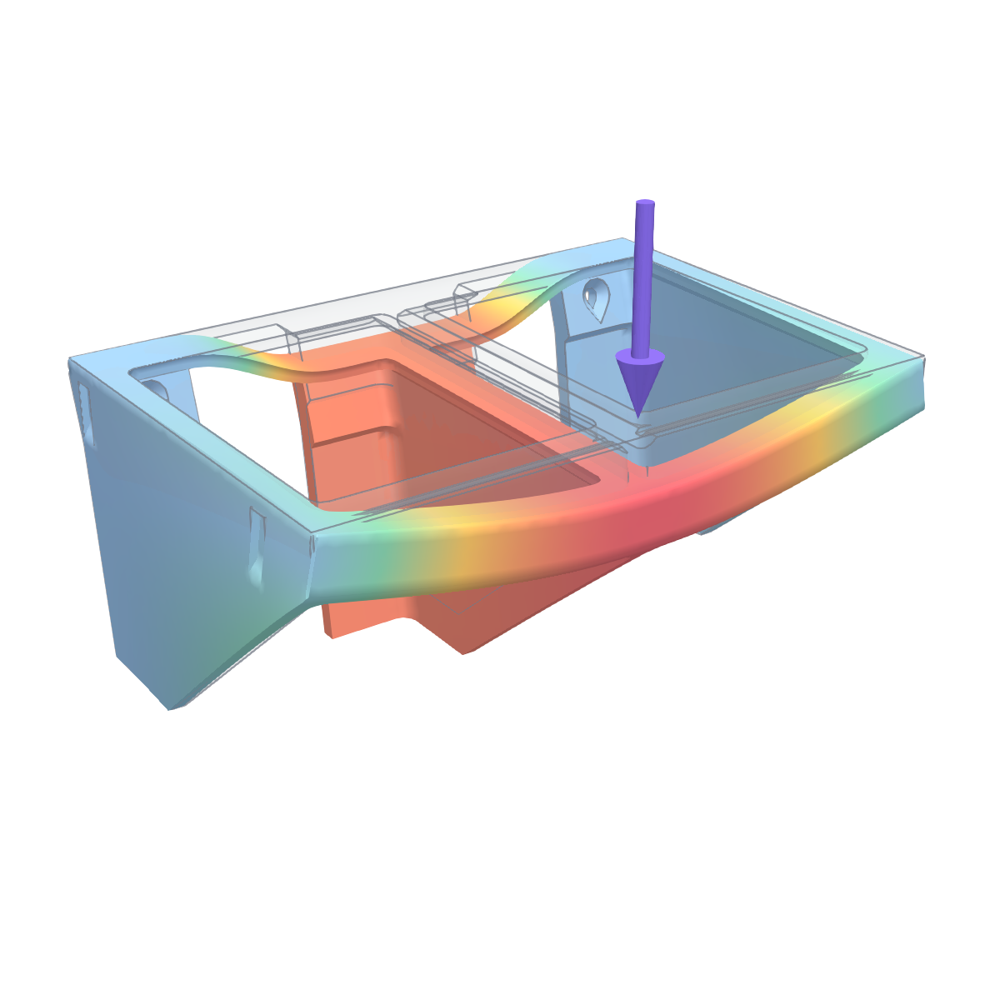

# JOBO CPE2 bottle hanger

A printed hanger for JOBO bottles in the water bath of a **JOBO CPE2 / CPE2+** processor. A module holds 2 bottles (2–4 if you change one parameter). It mounts on the tilted tank wall with two countersunk M4 screws, one at each end. On the outside of the tank a printed backplate holds the nuts, and a TPU gasket seals the screw holes.

 

## How it works

- Each bottle drops through a 88 × 70 mm window in the frame. A small bump on the bottle side catches under the **front lip**, so an empty bottle cannot float up.
- The **mount wall** follows the CPE2 tank wall, which kinks 17 mm below the rim: 17° lean above the kink, 7.5° below (relative to the frame).
- Two **M4 countersunk screws per module** (first and last hole) go through the hanger wall and the 1 mm tank wall into M4 nuts held in one printed **backplate** per module on the outside of the tank.
- A 1 mm **TPU gasket** with the same outline lies between the tank and the backplate; its holes are smaller than the screw, so it closes around it and keeps the bath water in.
- **Gussets** between the sections carry the load from the frame into the wall. Neighbouring sections share one gusset.
- Neighbouring modules click together with **2 press-fit tabs**: tabs on the +Y end, sockets on the −Y end. They sit in the end gusset below the 3 mm top panel, so the top stays whole and nothing shows from above.

## Files

| Path | What |
|---|---|
| `cad/JOBO_CPE2_Bottle_Hanger.FCStd` | Parametric FreeCAD model |
| `step/JOBO_CPE2_Hanger_{2,3,4}_Sections.step` | Hanger for 2, 3 or 4 bottles |
| `step/JOBO_CPE2_Hanger_2_Sections_Spacer20.step` | Spacer module: a 2-bottle hanger 20 mm longer on one end |
| `step/JOBO_CPE2_Backplate_M4_2_Sections.step` | Backplate for a 2-bottle module: 2 M4 nut pockets |
| `step/JOBO_CPE2_Gasket_TPU_2_Sections.step` | TPU gasket under the backplate |
| `fem/hanger_fem.py`, `docs/fem_results.json` | Strength check and its results |

## Model

- `Parameters` (spreadsheet): every size, with a comment per row. Derived rows are marked *do not edit*.
The tree is a short build chain; only the two parts in capitals are printed:

- `Cell` (PartDesign body, label *Step 1*): **one section** with all its features.
- `Array` (Draft array, label *Step 2*): `SECTIONS` cells at `PITCH` = 80 mm, fused into one solid. Each cell is `PITCH + G_T` long, so the end gussets of neighbours coincide and become one shared gusset.
- `Hanger_Final` (**HANGER — standard module**): PartDesign body on top of Step 2. It is identical to Step 2 and exists so the printed part has its own name.
- `Hanger_Spacer` (**HANGER + SPACER — spacer module**): the module made `SPACER_W` (20 mm) longer on its +Y end. The end section (frame, wall, front rib) is extruded and the end gusset moves to the new end (group *Spacer module build*), so the extension is closed underneath like any other part of the hanger.
- In both printed modules: the 2 mounting holes with countersinks (`*_Bolt_Holes`, `*_Countersink`), the 2 tabs (`*_Tenons`, both ends chamfered at `DT_LEAD` = 30°) and the 2 sockets (`*_Sock1`, `*_Sock2`, with a 30° roof instead of a flat bridge), so the joint prints without overhangs or bridges. Sizes: `DT_*` in `Parameters`; `DT_CLR` = −0.05 mm per side is the interference.
- `Module_Backplate` (**BACKPLATE — one per module**): `BP_LEN` × 16.8 × 8 mm (152 mm for 2 bottles), 2 Ø 4.4 holes and 7.3 mm hex pockets at the module ends. Placed in the model where it sits: outside the tank, on the upper flat part of the wall, coaxial with the screws.
- `Module_Gasket` (**GASKET — one per module**): same outline, `SEAL_T` = 1 mm, holes `SEAL_ID` = 3.8 mm.
- Group **Standard set**: the spacer module, the gap it bridges, and two standard modules, with their backplates and gaskets as they sit in the tank (links, view only).

Change `SECTIONS` (2, 3, 4…), `SPACER_W`, `TANK_T` or `BOLT_LEN` and recompute. Other useful values: `WIN_Y` (window width), `TANK_TILT`, `TANK_TILT2`, `KINK_Z` (tank wall shape), `BOLT_Y`, `NUT_AF`, `NUT_DEPTH`.

## Standard set

The tank is filled with **2-bottle modules** (each fits the bed easily): two standard modules and one spacer module.

| Part | Qty | STEP |
|---|---|---|
| Standard module | 2 | `JOBO_CPE2_Hanger_2_Sections.step` |
| Spacer module: a standard module **20 mm longer** on one end | 1 | `JOBO_CPE2_Hanger_2_Sections_Spacer20.step` |

The spacer module fills the 20 mm gap to the next module (picture below: spacer module on the left, then two standard modules). Frame, wall and front rib run on to its new end gusset, so it is closed underneath. In the model it is on the +Y end; `SPACER_W` sets the extra length.

**Joining modules.** Each module has 2 tabs (6 × 1.5 mm, 14 mm tall) on its +Y end and 2 sockets on its −Y end. Push the next module end-on against the previous one: the tabs click into the sockets with a light interference fit (0.05 mm per side) and hold the modules aligned. Add glue on the end faces if you want the row to be one piece. If your printer prints tight, set `DT_CLR` to 0.

## Printing

| Part | Qty | Orientation | Time / mass (PETG, A1) |
|---|---|---|---|
| Hanger, 2 sections (standard module) | 2 | frame face down, no supports | ≈ 3 h 31 min, 142 g |
| Spacer module | 1 | frame face down, no supports | ≈ 4 h 20 min, 187 g |
| Hanger, 3 sections | 1 | frame face down, no supports | ≈ 4 h 59 min, 213 g |
| Hanger, 4 sections | 1 | 323.6 mm long: does not fit a 256 mm bed | — |
| Backplate (2-bottle module) | 1 per module | flat face down, pockets up | ≈ 45 min, 24 g |
| Gasket, TPU 95A | 1 per module | flat, 100 % | ≈ 26 min, 3 g |

Profile: 0.4 mm nozzle, 0.6 mm lines, 0.2 mm layers, 5 walls, 100 % rectilinear infill. PETG or ABS; not PLA, because the bath is warm.

## Mounting

Per 2-bottle module: **2 × M4 × 16** countersunk screws (ISO 10642 or ISO 14581, head Ø ≤ 9 mm), 2 × M4 nuts (7 mm AF), 1 backplate, 1 gasket.

Stack along a screw: hanger wall 6 mm + tank 1 mm + gasket 1 mm + backplate 8 mm = 16 mm. The nut pocket depth follows `BOLT_LEN` (3.7 mm for M4 × 16), so the screw end comes flush with the outer face of the backplate. `D_SCREW` shows the shortest screw that fills the nut. If your tank wall is thinner or thicker, set `TANK_T`.

1. Put the nuts into the backplate pockets.
2. Hold the gasket and the backplate against the outside of the tank.
3. Insert the screws from the bottle side and tighten gently: the gasket only needs to be compressed, and PETG creeps under high pressure.

## Strength (FEM, one 2-bottle module, 2 screws)

CalculiX, second-order tetrahedra, layered PETG (40 / 20 / 15 MPa in-plane / layer peel / layer shear, × 0.85 for the warm bath). The 2 screw seats are bonded; the tank wall pushes on the part but cannot pull, so each case is supported only on the wall segment that is pressed into the tank.

| Case | Load | Load / allowable (≤ 1 passes) |
|---|---|---|
| Empty bottles floating (sustained, safety factor 4) | 5.9 N up on the lip of both sections | **0.78** ✅ |
| Full 0.7 kg bottle knocked onto the front edge at 0.5 m/s, between the sections (safety factor 2) | 123 N (stiffness 87 N/mm) | **4.49** ⚠️ |

**With only 2 screws a hard knock is a risk.** Between the screws the top of the wall is not held against the tank, so a knock in the middle of the front edge peels the wall from the frame (layer peel at the wall/frame junction, about 2 × the material strength). With a screw at every hole (4 per module) the same knock gave about 1.1. Daily use (bottles in and out, floating) is fine; avoid dropping a full bottle onto the front edge. Forces balance in both cases (residual 0.0 N).

 

## History

Release `v1.1.0` built 2-, 3- and 4-section hangers by joining copies of one section with seam patches. This version rebuilds them as one parametric cell plus an array, uses one M4 nut backplate and a TPU gasket per module, 2 screws per module, dovetails between modules, and keeps the geometry of the printed and tested section (hook, tilted wall with the kink, gussets, countersinks).
