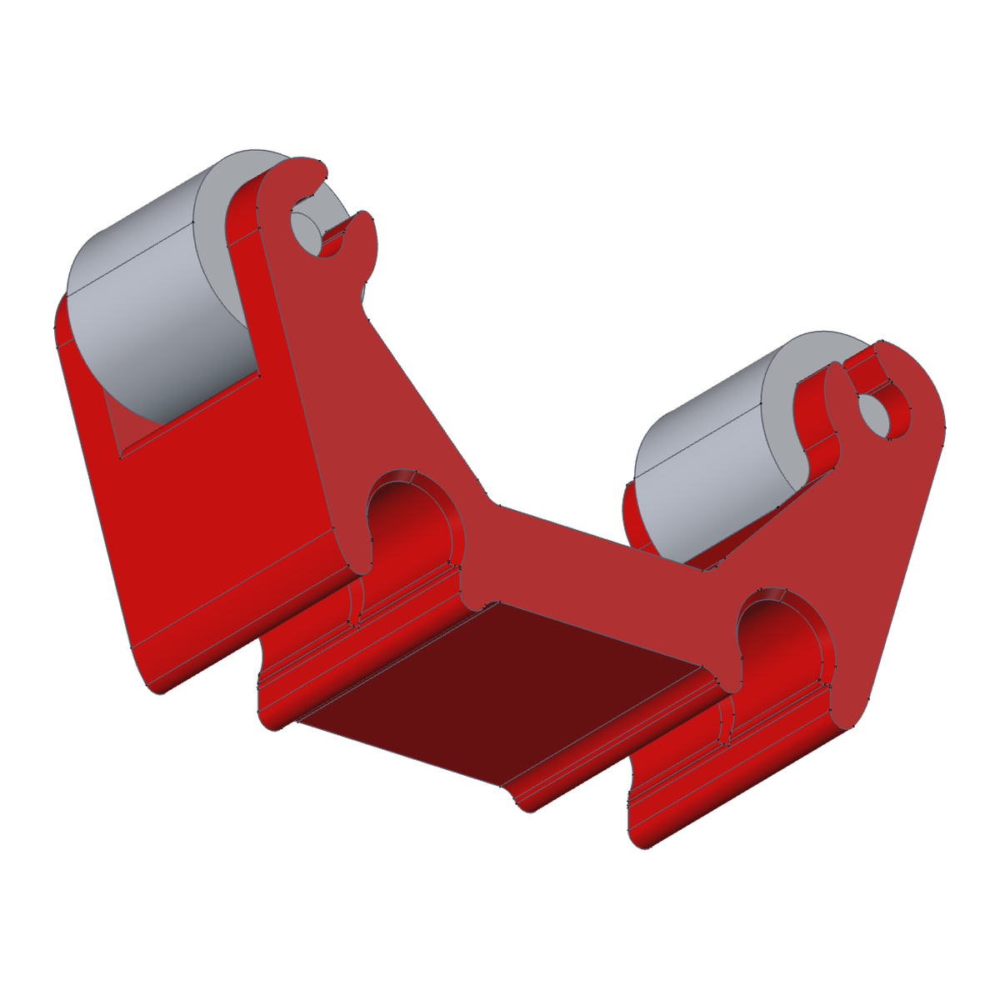
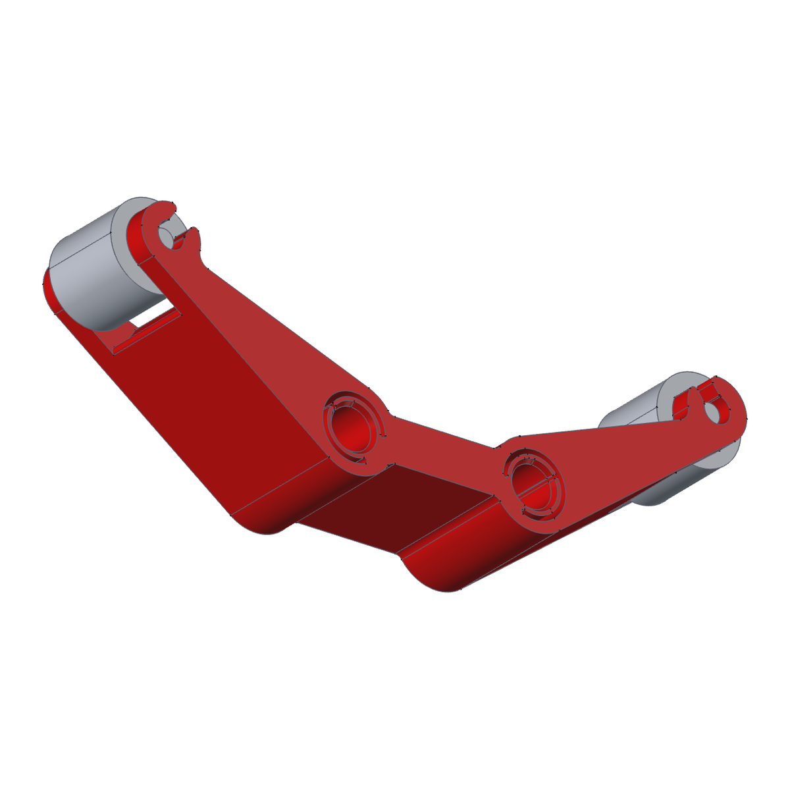
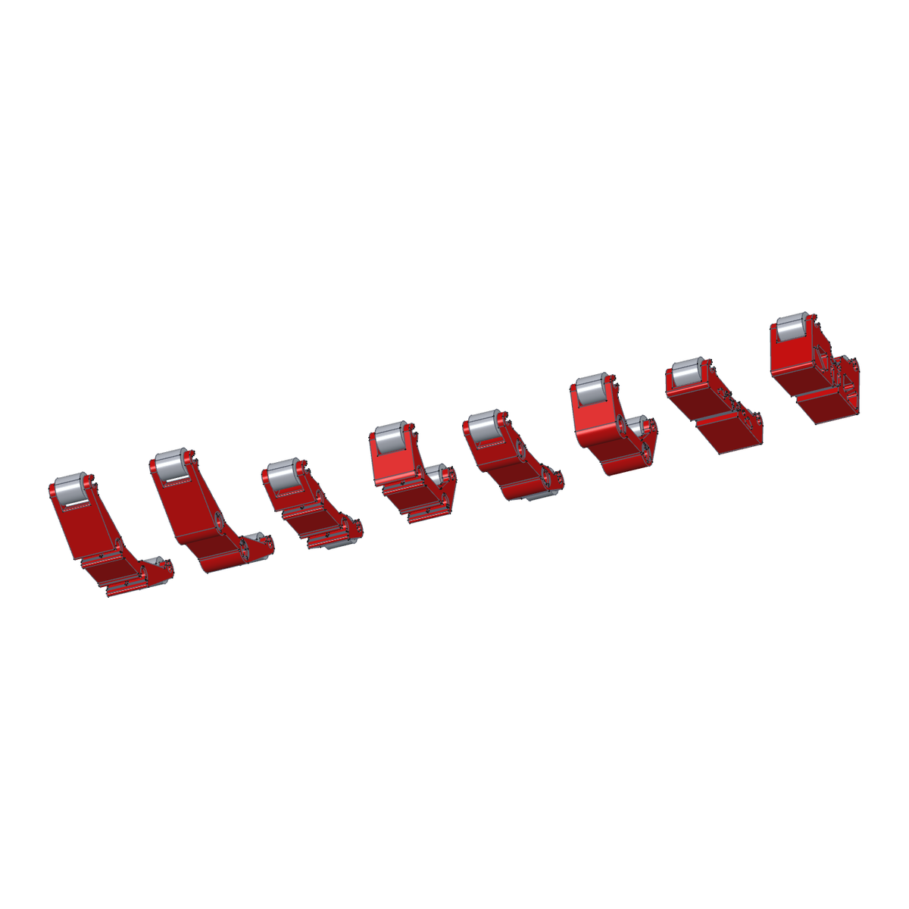
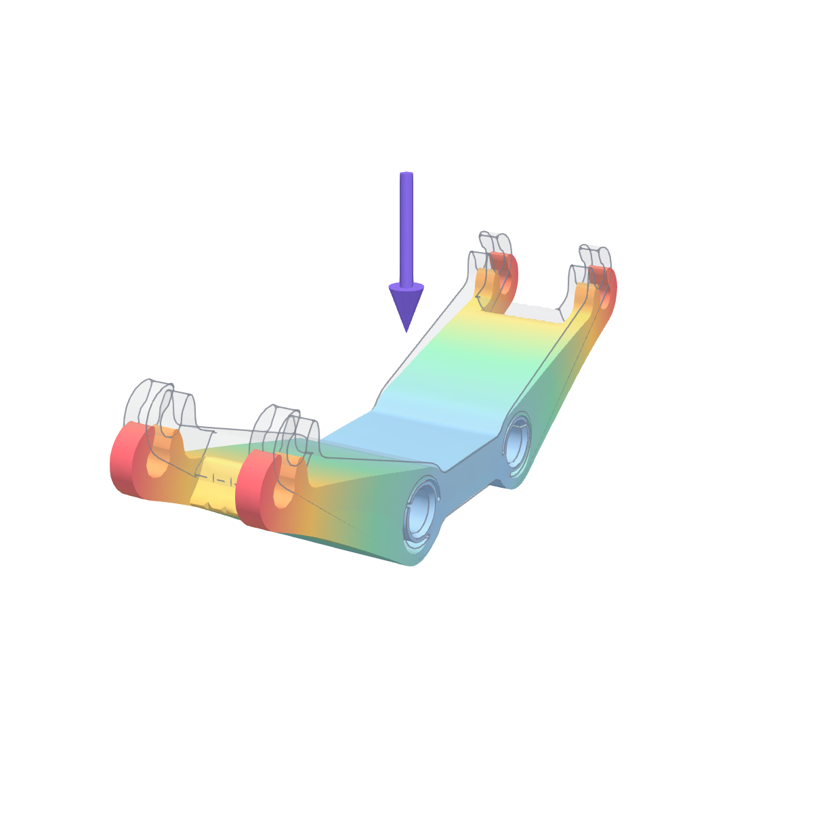
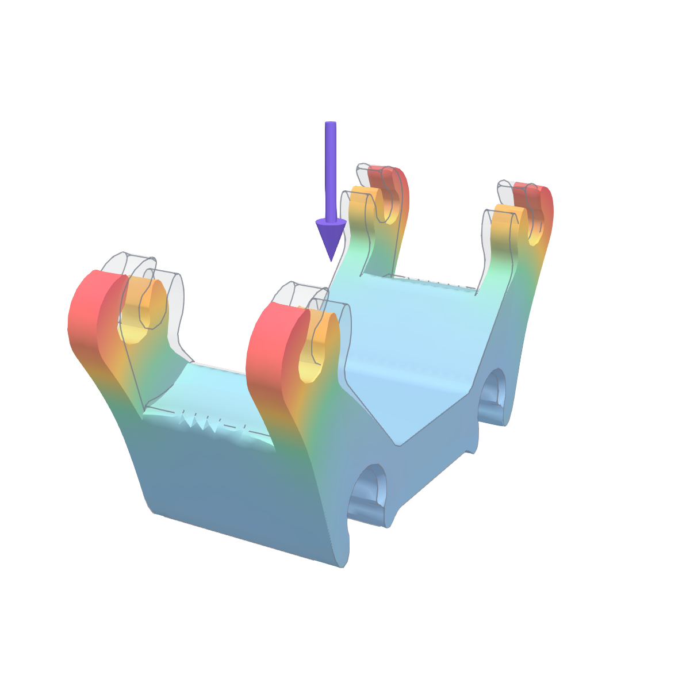
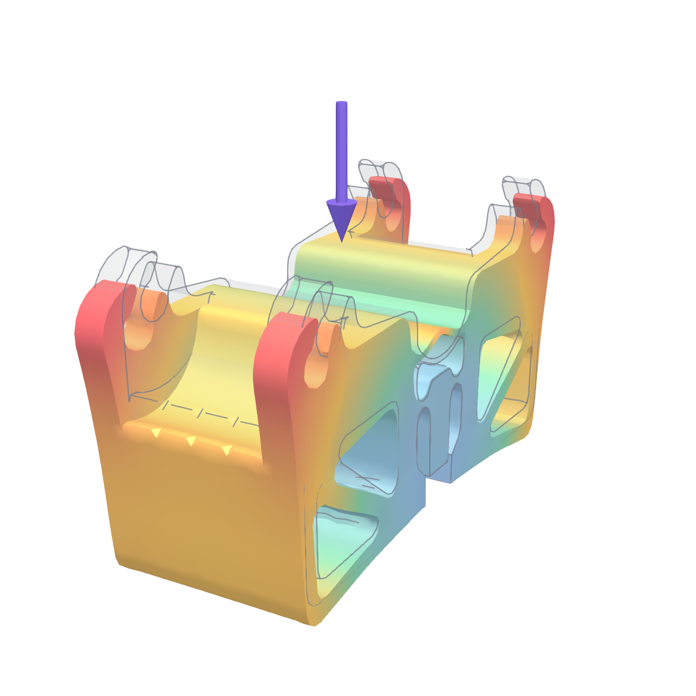

# JOBO drum supports

Printed roller supports for JOBO drums. Two families:
- **Stands** clip onto the 10 × 5 mm rib in the water bath of a **JOBO CPE2 / CPE2+**. They carry the far end of the drum on two rollers. No screws or tools are needed.
- **Lift supports** sit on the two Ø 9.7 mm rods of the JOBO **lift**, 43 mm apart, and carry the drum when it is raised.

⬇️ **Download:** [Stand 1500](https://github.com/sasha-nordiclab/jobo-repair-parts/raw/main/drum-support/step/Stand_1500.step) · [Stand 2840](https://github.com/sasha-nordiclab/jobo-repair-parts/raw/main/drum-support/step/Stand_2840.step) · [Lift 1500 A](https://github.com/sasha-nordiclab/jobo-repair-parts/raw/main/drum-support/step/Lift_1500_A.step) · [Lift 1500 B](https://github.com/sasha-nordiclab/jobo-repair-parts/raw/main/drum-support/step/Lift_1500_B.step) · [Lift 2500 A](https://github.com/sasha-nordiclab/jobo-repair-parts/raw/main/drum-support/step/Lift_2500_A.step) · [Lift 2500 B](https://github.com/sasha-nordiclab/jobo-repair-parts/raw/main/drum-support/step/Lift_2500_B.step) · [Lift Expert A](https://github.com/sasha-nordiclab/jobo-repair-parts/raw/main/drum-support/step/Lift_Expert_A.step) · [Lift Expert B](https://github.com/sasha-nordiclab/jobo-repair-parts/raw/main/drum-support/step/Lift_Expert_B.step) · [FreeCAD model](https://github.com/sasha-nordiclab/jobo-repair-parts/raw/main/drum-support/cad/Jobo_Drum_Support.FCStd) · [JOBO roller (reference, not printed)](https://github.com/sasha-nordiclab/jobo-repair-parts/raw/main/drum-support/step/Roller_Jobo_reference.step)

All of them use the **original JOBO rollers** (Ø 20 × 20 mm, Ø 4.8 mm pins), which snap into the cheeks from above.

  

## Parts

| Part | For | Mount | STEP |
|---|---|---|---|
| `Stand_1500` | 1500-series drums, Ø 95 | clip onto the bath rib | `step/Stand_1500.step` |
| `Stand_2840` | 2800-series drums, Ø 137 | clip onto the bath rib | `step/Stand_2840.step` |
| `Lift_1500_A` / `Lift_1500_B` | 1500-series drums | lift rods: A slides on with closed collars, B snaps on from above | `step/Lift_1500_*.step` |
| `Lift_2500_A` / `Lift_2500_B` | 2500-series drums, Ø 137 | as above | `step/Lift_2500_*.step` |
| `Lift_Expert_A` / `Lift_Expert_B` | Expert drums, Ø 206.9, on the upper coupling | as above | `step/Lift_Expert_*.step` |
| Roller | reference only (original JOBO part) | — | `step/Roller_Jobo_reference.step` |

The drum axis is 75 mm above the rods for the 1500 and 2500 lift supports, and 121.5 mm for the Expert ones.

## How the stands work

- **Self-clamping jaws.** The stand is a compliant "pliers" with a flexure hinge on each side. Each half is modelled turned in by `PRE_ANG` (1.4° on the 1500 stand), so the jaws print slightly closed. Pushed onto the rib, they spread and grip both sides.
- **The drum adds grip.** Its weight presses the rollers down and out, and the arms turn that into more jaw pressure.
- You can slide the stand along the rib to suit the length of your drum.

## Files and model

| Path | What |
|---|---|
| `cad/Jobo_Drum_Support.FCStd` | All parts in one parametric FreeCAD model |
| `step/` | One STEP per part |
| `fem/drum_fem.py`, `docs/fem_results.json` | Strength check and its results |
| `renders/` | Product images |

In the model tree:
- **Stands — clip onto the bath rib**, **Lift supports A — rod collars**, **Lift supports B — snap on from above**: each part body together with its two roller links.
- **Parameters**: one spreadsheet per part, `Params_<part>`. Change a value and recompute.
- **Shared**: the one roller body. All rollers in the model are links to it.

## Printing

Print in **PETG or ABS**, not PLA: the parts sit in water at 38–40 °C, where PLA creeps and the stand loses its grip.

| Part | Time / mass (PETG, A1, flat, with supports in the roller slots) |
|---|---|
| Stand_1500 / Stand_2840 | ≈ 2 h 35 min, 62 g / ≈ 2 h 04 min, 39 g |
| Lift_1500_A / B | ≈ 1 h 46 min, 39 g / ≈ 1 h 27 min, 35 g |
| Lift_2500_A / B | ≈ 1 h 41 min, 35 g / ≈ 1 h 27 min, 31 g |
| Lift_Expert_A / B | ≈ 2 h 01 min, 54 g / ≈ 1 h 45 min, 51 g |

The roller slots are in the middle of the thickness. To print without supports, cut the part in half in the slicer:
1. Lay it flat on its large side.
2. Use the Cut tool through the middle of the thickness, with **Dowel** connectors (about Ø 5 × 10 mm) in solid areas. Keep them away from the spring, the hinge necks and the jaws.
3. Print both halves cut face up, then glue them: CA or epoxy for PETG, ABS slurry for ABS. Keep glue out of the spring and hinge slots.

Settings: 0.2 mm layers, 4 walls, 25–30 % gyroid, 100 % scale (the spring and hinges are tuned to the printed size).

## Strength (FEM)

CalculiX, second-order tetrahedra, layered PETG (40 / 20 / 15 MPa in-plane / layer peel / layer shear, × 0.85 for the warm bath), safety factor 4 for sustained loads. The drum weight is applied through the two roller axles along the lines from the drum centre to each roller. **The whole drum is put on one support**, which is twice what a support carries when the drum rests on two. Assumed full drums: 1500 → 1 kg, 2500 → 2 kg, Expert → 3 kg.

| Part | Drum on one support | Load / allowable (≤ 1 passes) |
|---|---|---|
| Lift_1500_A / B | 1 kg | 0.16 / 0.08 ✅ |
| Lift_2500_A / B | 2 kg | 0.19 / 0.17 ✅ |
| Lift_Expert_A / B | 3 kg | 1.13 / 0.48 |
| Stand_1500 / Stand_2840 (jaws held on the rib) | 1 kg / 2 kg | 0.08 / 0.18 ✅ |

- **Lift_Expert_A** passes once the drum is shared by two supports (≈ 0.57). The peak is layer peel in the collar next to a rod seat.
- **Stand_1500, permanent clamp on the rib.** The model pushes the jaws open onto a 10 mm rib (frictionless): about 105 N per jaw, and the spring works at about 3/4 of the material strength. That is 3.6 × the sustained allowable, so the spring **will relax over time** in warm water. Take the stand off the rib when the processor is not in use. The stand-2840 clamp model was not stable and gave no usable number.

Forces balance in every case (residual 0.0 N).

  

## Tips

- The clamp relies on a 10.0 mm rib. If it grips too hard or too softly, measure your rib.
- Keep the stand off the rib when you are not developing, so the spring keeps its tension longer.
